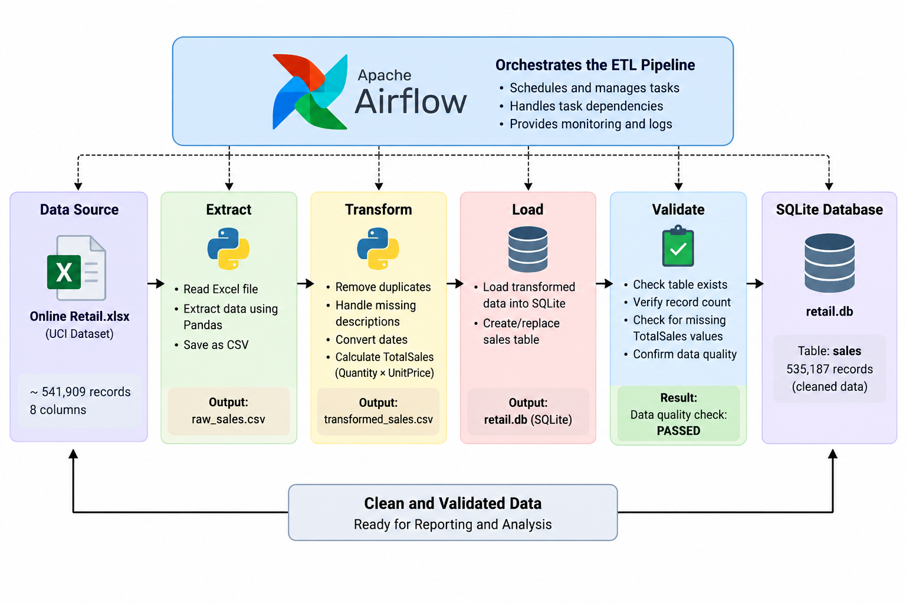

# ETL Pipeline with Apache Airflow

## 1. Project Overview

This project demonstrates the development of an Extract, Transform and Load (ETL) data pipeline using Python, Pandas, SQLite and Apache Airflow.

The project uses the **UCI Online Retail dataset**, containing retail transaction data from a UK-based online retailer.

The objective is to demonstrate how raw data can be extracted, cleaned, transformed, loaded into a database and validated as part of an automated data pipeline.

---

## 2. Business Objective

The purpose of the pipeline is to convert raw retail transaction data into a clean and structured dataset that can be used for reporting and further analysis.

The pipeline performs the following activities:

* Extracts retail transaction data.
* Removes duplicate records.
* Handles missing descriptions.
* Converts transaction dates into a suitable date format.
* Calculates total sales for each transaction.
* Loads the transformed data into a SQLite database.
* Performs data-quality validation.

---

## 3. Dataset

**Dataset:** Online Retail

**Source:** UCI Machine Learning Repository

The dataset contains approximately 542,000 retail transaction records and includes the following fields:

* InvoiceNo
* StockCode
* Description
* Quantity
* InvoiceDate
* UnitPrice
* CustomerID
* Country

The original dataset contained:

* **541,909 rows**
* **8 columns**
* **5,268 duplicate rows**
* Missing values in Description and CustomerID

Dataset citation:

Chen, D. (2015). *Online Retail*. UCI Machine Learning Repository. DOI: 10.24432/C5BW33.

---

## 4. ETL Architecture



```text
                 RAW DATA
                    |
                    v
          +-------------------+
          |     EXTRACT       |
          |    Python/Pandas  |
          +-------------------+
                    |
                    v
          +-------------------+
          |    TRANSFORM      |
          | Remove duplicates |
          | Handle missing    |
          | Convert dates     |
          | Calculate sales   |
          +-------------------+
                    |
                    v
          +-------------------+
          |       LOAD        |
          |      SQLite       |
          +-------------------+
                    |
                    v
          +-------------------+
          |     VALIDATE      |
          | Data quality      |
          | checks            |
          +-------------------+
```

---

## 5. ETL Pipeline

The pipeline follows four main stages:

### Extract

The `extract.py` script reads the original Excel dataset and converts it into a CSV file.

Input:

```text
data/Online Retail.xlsx
```

Output:

```text
data/raw_sales.csv
```

The extraction process successfully produced **541,909 records**.

### Transform

The `transform.py` script performs data cleaning and transformation.

The transformation includes:

* Removing duplicate records.
* Removing records where Description is missing.
* Converting InvoiceDate to datetime.
* Creating a new `TotalSales` column.

The calculation used is:

```text
TotalSales = Quantity × UnitPrice
```

After transformation, the dataset contained **535,187 records**.

### Load

The `load.py` script loads the transformed CSV file into a SQLite database.

Database:

```text
data/retail.db
```

Table:

```text
sales
```

The database contains **535,187 records**.

### Validate

The `validate.py` script checks that:

* The sales table exists.
* Records have been loaded.
* TotalSales does not contain missing values.

Validation result:

```text
Sales table exists: True
Rows in sales table: 535187
Missing TotalSales values: 0
Data quality check: PASSED
```

---

## 6. Apache Airflow

Apache Airflow is used to define the ETL workflow and task dependencies.

The DAG is called:

```text
sales_etl_pipeline
```

The workflow is:

```text
Extract
   |
   v
Transform
   |
   v
Load
   |
   v
Validate
```

The Airflow DAG uses the following task dependency:

```python
extract >> transform >> load >> validate
```

This ensures that each stage follows the correct order.

---

## 7. Project Structure

```text
airflow-etl-project/
│
├── airflow/
├── dags/
│   └── sales_etl_dag.py
│
├── Script/
│   ├── extract.py
│   ├── transform.py
│   ├── load.py
│   └── validate.py
│
├── data/
│   ├── Online Retail.xlsx
│   ├── raw_sales.csv
│   ├── transformed_sales.csv
│   └── retail.db
│
├── docker-compose.yaml
├── Dockerfile
├── .env
└── README.md
```

---

## 8. Technologies Used

| Technology     | Purpose                             |
| -------------- | ----------------------------------- |
| Python         | ETL scripting                       |
| Pandas         | Data extraction and transformation  |
| OpenPyXL       | Reading Excel data                  |
| SQLite         | Data storage                        |
| Apache Airflow | Workflow orchestration              |
| Docker         | Airflow environment                 |
| Git/GitHub     | Version control and project sharing |
| Markdown       | Documentation                       |

---

## 9. Setup Instructions

### Prerequisites

Install:

* Python 3.x
* Docker Desktop
* Git
* Apache Airflow through the provided Docker configuration

### Python Dependencies

Install the required Python packages:

```bash
pip install pandas openpyxl
```

### Run the ETL Scripts

From the project root:

```bash
python Script/extract.py
```

Then:

```bash
python Script/transform.py
```

Then:

```bash
python Script/load.py
```

Finally:

```bash
python Script/validate.py
```

---

## 10. Running with Docker and Airflow

The project includes a Docker Compose configuration for running Apache Airflow.

The Airflow DAG is located at:

```text
dags/sales_etl_dag.py
```

The DAG defines the ETL workflow:

```text
Extract → Transform → Load → Validate
```

Airflow can be accessed locally through port 8080 when the Docker Airflow services are running.

---

## 11. Data Quality

Data-quality checks were included to improve reliability.

The project checks:

* Duplicate records.
* Missing descriptions.
* Record counts.
* Database table existence.
* Missing TotalSales values.

The final validation confirmed:

```text
535,187 records loaded
0 missing TotalSales values
Data quality check: PASSED
```

---

## 12. Results

The pipeline successfully processed the UCI Online Retail dataset.

| Stage                                | Records |
| ------------------------------------ | ------: |
| Original dataset                     | 541,909 |
| After duplicate removal and cleaning | 535,187 |
| Loaded into SQLite                   | 535,187 |
| Missing TotalSales                   |       0 |

The successful validation demonstrates that the transformed dataset was loaded into the database correctly.

---

## 13. Limitations

The project is designed as a training ETL project and therefore has some limitations:

* SQLite is suitable for demonstration but may not be appropriate for large production workloads.
* The pipeline currently processes a local dataset.
* Error handling and monitoring could be expanded for production use.
* Additional data-quality rules could be introduced.
* Cloud storage and production database services could be added in a future version.

---

## 14. Future Improvements

Possible future enhancements include:

* Migrating SQLite to PostgreSQL or a cloud database.
* Adding automated data-quality frameworks.
* Adding logging and alerting.
* Adding unit tests.
* Scheduling regular pipeline runs through Airflow.
* Connecting the database to Power BI for reporting.
* Containerising the complete ETL application.
* Adding CI/CD through GitHub Actions.

---

## 15. Contribution Guidelines

Contributions should follow these guidelines:

1. Create a separate branch for changes.
2. Keep changes focused on a specific feature or improvement.
3. Test changes before submitting them.
4. Update the documentation where necessary.
5. Submit changes through a pull request.
6. Provide a clear description of the changes.

---

## 16. Conclusion

This project demonstrates the core principles of an ETL pipeline by extracting raw retail data, transforming and cleaning the data, loading it into a database and performing data-quality validation.

The project also demonstrates the use of Apache Airflow and Docker for workflow orchestration and environment management.
